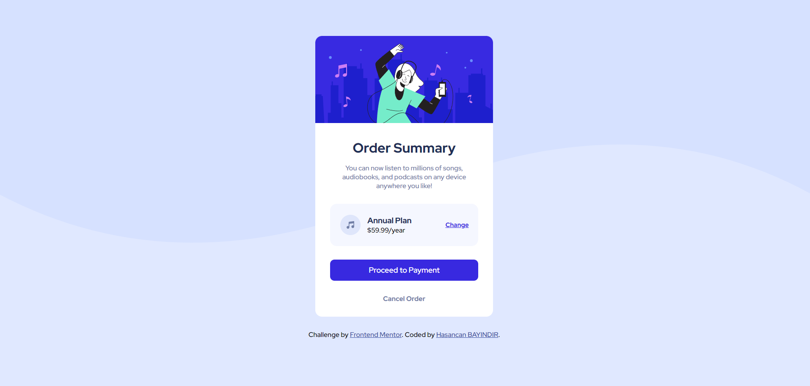

## My process

### Built with

- Semantic HTML5 markup
- CSS custom properties
- Flexbox

### What I learned


```html
<h1>Some HTML code I'm proud of</h1>
```

```css
body {
    background-image: url(/images/pattern-background-desktop.svg);
    background-repeat: no-repeat;
    background-size: contain;
    position: relative;
    background-color: hsl(225, 100%, 94%);
    display: flex;
    flex-direction: column;
    justify-content: center;
    align-items: center;
    font-size: 16px;
    height: 100vh;
}

Here my media query

@media only screen and (max-width: 375px) {

    body {
        background-image: url(/images/pattern-background-mobile.svg);
        font-size: 14px;
    }

    .container {
        max-width: 88%;
    }

    .pricing {
        max-width: 88%;
        padding: 12px;
    }

    .pricing a {

        font-size: 12px;
    }

    button {
        max-width: 88%;
    }
}
```

### Useful resources

-Resource 1 www.cssgenerator.org/ - This helped me for some shadow settings.